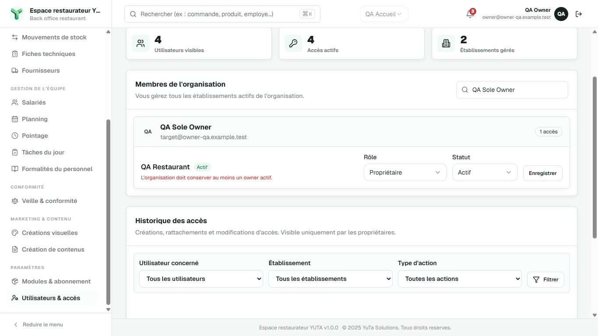
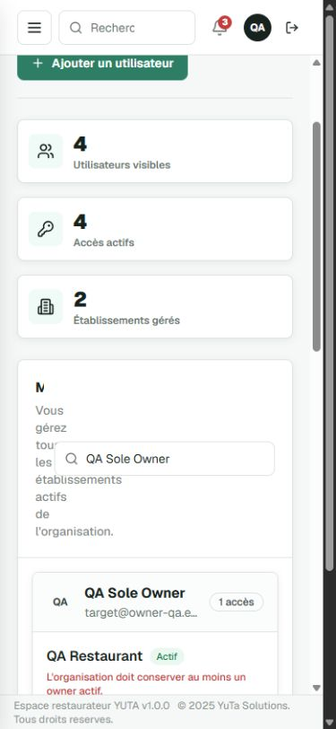

# Browser QA — establishment OWNER preservation

Change: preserve-establishment-owner-invariant

Date: 2026-09-06

UI_AFFECTING: YES

BROWSER_QA_REQUIRED: YES

QA status: FAIL

Route(s): `http://owner-qa.localhost:3101/parametres/utilisateurs-acces`

## Data/test setup

Real built Backoffice, separate loopback server on 3101, process-only cloud DB
override to disposable `yuta_owner_preservation_test` at 127.0.0.1:60098.
Existing DB migrations only, no production/persistent development data.
Synthetic organization `01a0769a-43db-71b8-8438-5e17cdda724f`, establishments
QA Accueil and QA Restaurant. Four synthetic identities: QA Owner (OWNER at
Accueil only), QA Sole Owner (sole OWNER at Restaurant), QA Manager and QA Staff
at Restaurant. Random temporary password generated for this run; not retained
in repository. No external messages, invitation delivery or providers.

Server command after process environment override:
`pnpm --filter @yuta/backoffice exec next start --hostname 127.0.0.1 --port 3101`.
AUTH_SECRET was randomly generated in that process, not written to env files.
Browser host isolates cookies from normal localhost sessions. Login used the
real /connexion form, validated session and normal navigation; no session bypass
or client fixture replacement. Technical VERIFY passed before this QA started.

## Roles/states and viewports

- OWNER authenticated at Accueil, managing sole OWNER of Restaurant through
  normal trusted organization management scope.
- Desktop 1366x768: initial persisted members, self-membership disabled,
  demotion submission pending, LAST_OWNER_REQUIRED error and restored role.
- Mobile 390x844: same authenticated error state; responsive failure found.
- MANAGER runtime checks, mobile mutation flow, attachment rejection/success,
  valid edit success/reload and widths 1440/1024/768 were NOT completed: STOP
  on confirmed out-of-allowlist UI defect. They are not PASS by inference from
  repository tests.

## Scenarios tested

1. Login OWNER through real credentials/session: PASS.
2. Open actual access-management route and search QA Sole Owner: PASS.
3. Select Employé, submit Enregistrer using Enter: pending disabled button
   observed, then existing French error
   `L'organisation doit conserver au moins un owner actif.`: PASS.
4. Returned form shows Propriétaire / Actif and enabled Enregistrer; no success
   history event. Independent SQL read confirms exactly one active OWNER and
   zero `tenant.%` success audit events in the synthetic organization: PASS.
5. Mobile responsive layout: FAIL, evidence below.

## Accessibility checks

Desktop submit operated with Enter; error exposed as alert; role/status labels
and button names present; pending button disabled then enabled. Full keyboard,
focus, dialog and mobile accessibility matrix incomplete after STOP.

## Visual/responsive findings

At 390x844, “Membres de l'organisation” heading is compressed to 10px
(`clientWidth=10`, `scrollWidth=206`). Its bounding box is x41/y437/w10/h24.
The search input remains 256px wide (x63/y511/w256/h40). Description wraps into
a narrow column and is visually obscured by the search field. This is a real
route screenshot, not a generated mockup. Document scrollWidth375 is below
innerWidth390: absence of page-level horizontal overflow does not mean no
internal clipping/overlap.

Desktop innerWidth1366/innerHeight768 and no page horizontal overflow observed.
Captured console error/warning list was empty for this QA tab; not a claim about
unvisited states or other environments.

## Regression findings and attribution

The clipping is in pre-existing presentation, outside implementation allowlist:

- `apps/backoffice/src/app/(authenticated)/parametres/utilisateurs-acces/_components/users-access-list.tsx:44`
  supplies fixed `w-64` search as Panel action.
- `packages/ui/src/panel.tsx:85` keeps the action non-shrinking.

`git diff --exit-code HEAD -- <each path>` returned 0; neither file was changed
by this task. UsersAccessList SHA-256:
`38f9a9640b55bde0beda5f6efe137c1be49172a091c39fcf95051abfbd289a94`.
This is not evidence of a new locking/security regression. Nevertheless the
mandatory responsive QA cannot be marked PASS or waived. No UI fix attempted.

## Screenshot evidence

See [manifest](screenshot-manifest.md) for exact hashes.

## Stop and next authority

STOP_FOR_REVIEW. No `03-final-review.md` created. Technical invariant remains
proven; required QA remains FAIL/incomplete. Need explicit review of a narrow
responsive UI repair scope (prefer owning route, no assumed shared UI change),
then rerun technical checks and all remaining mandatory QA. Existing Apply
authorization does not permit expanding to UI implementation files.

Temporary QA tab closed and viewport reset. Temporary server stopped after
evidence capture; this is intentional QA cleanup, not a production-app outage.
`docker stop yuta-owner-preservation-20260906` and
`docker rm yuta-owner-preservation-20260906` completed. Only synthetic disposable
tmpfs data was removed and cannot be recovered; three persistent development
containers remain. Reports and screenshots are retained in the repository.
No deploy, sync/archive, lifecycle promotion or unrelated work cleanup.
